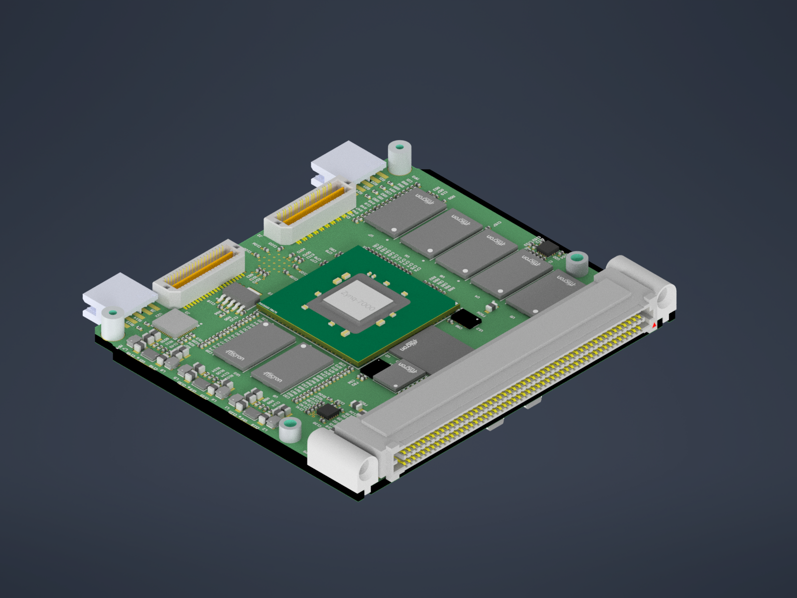
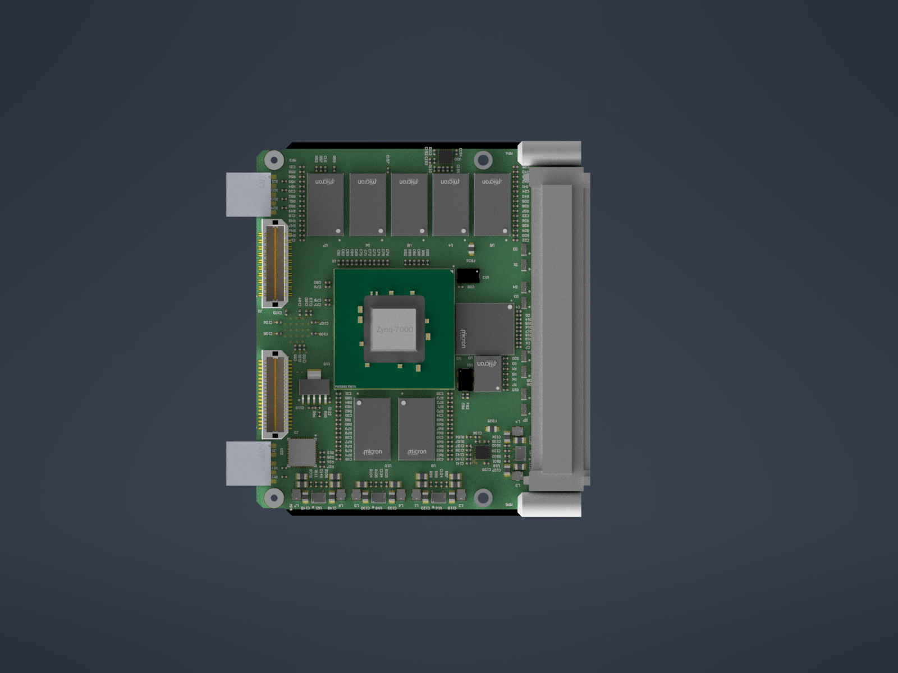

# SpaceVNXBaseBoard
A SpaceVNX format (VITA 74.4) carrier based on Zynq-7000 series intended to be used as SDR Payload on CubeSat applications.
Mitigations for Radiation Tolerance have been applied or identified for future revisions and is compliant to ECSS-Q-ST-70-12C where possible.
WIP - Pending finishing Routing, minimal changes in schematic expected

## Key Features
- Based on Z-7030 in FBG676 package, provides a upgrade path with pin compatible parts in packages FBG676 and FFG676 namely Z-7030, Z-7035 and Z-7045.
- 1 Gbyte DDR3L conected to Processor System (x32 No ECC) implemented using MT41K256M16TW-107 AAT.
- 2 Gbyte DDR3L connected to Programable Logic with EDAC protection (x72 ECC) implemented using MT41K256M16TW-107 AAT.
- Zynq Configuration NOR Flash MT25QL128ABB8E12-0AUT (A second chip could be fitted instead of eMMC for redundancy).
- Aditional Non Volatile Memory implemented using MTFC32GAPALBH-AAT eMMC for OS and Application Software storage.
- Two ADIN1300 Ethernet Phy conected to PL aiming to test TSN solution for On-Board ring topology data bus (Would implement with VSC8541 as there is a Rad-Hard version but chip shortage it is...)
- Two ADIN1300 Ethernet Phy conected to PS in order to use both Zynq-7000 provided GEM, intended to be used on redundat switches implementing Control Plane of the Backplane.
- All Ethernet interfaces include no magnetics as are expected to operate AC Coupled over Backplane.
- Redundant CAN Space Enhanced Plastic transceivers.
## Daughter Board
- LMK04610RTQR Jitter Cleaner in order to enable TSN protocols gPTP, SynE, IEEE 1588 Timestamping as well as clocking backbone for JESD204B interface.
- Supports Mezzanine Boards with two board to board connectors QTE-020-01-F-D-A and QTH-020-01-F-D-DP (GTXE2 transceivers and several single ended discrete IO's available) aiming mainly at JESD204B/C enabled data Converters.
